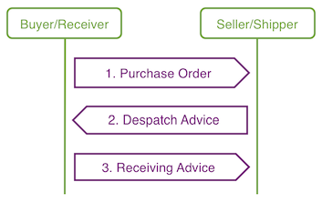
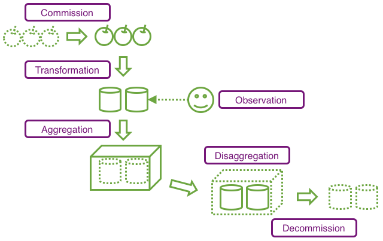

<PageDescription>

To enable product tracing and data sharing, **IBM Blockchain Transparent Supply™** supports multiple
data types based on GS1 standards. Each data type is encoded in an XML message,
in a unique format, derived from <a href="https://www.gs1.org/docs/gdsn/3.1/BMS_GDSN_Trade_Item_Modules_r3p1p4_i1p1p8_Sept2017.pdf"
target="_blank">GS1 Business Message Standards</a> and <a href="https://www.gs1.org/edi-xml/technical-user-guide"
target="_blank">GS1 XML 3 Standards</a>.

</PageDescription>

## Data types

Each message uploaded to IBM Blockchain Transparent Supply™ must be in the supported XML format for its
data type. The data types shown in Table 1 below are implemented by IBM Blockchain Transparent Supply™:

Table 1. IBM Blockchain Transparent Supply™ data types

Data type | Description | Standard
-- | -- | --
[Master data](#master-data) | Product (item), facility (location), and lot (batch) information | <a href="https://www.gs1.org/standards/gdsn/gdsn-basic-party-synchronisation/3-1" target="_blank">GS1 GDSN Standard</a>
[Business transactions](#business-transactions) | Purchase Order (PO), Despatch Advice (DA/ASN), and Receive Advice documents | <a href="https://www.gs1.org/standards/gs1-xml/3-3" target="_blank">GS1 XML Standard</a>
[EPCIS Events](#epcis-events) | Product: Observation, Transformation, Commission, Decommission, Aggregation, and Disaggregation Events. | <a href="https://www.gs1.org/sites/default/files/docs/epc/EPCIS-Standard-1.2-r-2016-09-29.pdf" target="_blank">GS1 EPCIS Standard</a>
[Payload data](/reference/payloads) | Generic string-encoded payloads | IBM Blockchain Transparent Supply™
[Cryptographic signing](#cryptographic-signing) | Encoded public signing keys | IBM Blockchain Transparent Supply™

The IBM Blockchain Transparent Supply™ data types, and their associated message types, are explained in the following sections.

**Attention: Event and Transaction documents that reference the same product instance or lot (GTIN or product ID)
or location (GLN or facility ID) are shared with authorized organizations to create end-to-end supply chain views for that
product instance.**

## Master Data

**Master Data** describes organization facility locations (GLNs or IBM Blockchain Transparent Supply™ facility IDs) and trade items (GTINs or IBM Blockchain Transparent Supply™ product IDs), and are expected to be largely static.

Master data types, their corresponding message types, and Samples are shown in Table 2 below:

Table 2. Master data message types

Master data type | Message type | Sample XML message
-- | -- | --
[Master facility data](#master-facility-data) | Basic facility registration | [MasterData-Facility-Annotated](/files/xml-annotated-samples/xml-MasterData-Facility-Annotated)
[Master item data](#master-item-data) | Item data notification | [MasterData-Item-Annotated](/files/xml-annotated-samples/xml-MasterData-Item-Annotated)
[Instance/Lot Master data (ILMD)](#instancelot-master-data-(ilmd)) | Object Add or Transformation | [EPCIS-Commission](/files/xml-annotated-samples/xml-EPCIS-Commission) / [EPCIS-Transformation](/files/xml-annotated-samples/xml-EPCIS-Transformation)

**Attention**: IBM Blockchain Transparent Supply™ Master data message types are based on the <a href="https://www.gs1.org/standards/gdsn/gdsn-basic-party-synchronisation/3-1" target="_blank">GS1 GDSN Standard</a> (download this standard .zip file and refer to the /Schemas/gs1/gdsn/ files).

### Master facility data

The **Master facility data** XML message type is derived from the <a href="https://www.gs1.org/standards/gdsn/gdsn-basic-party-synchronisation/3-1" target="_blank">GS1 Basic Party Registration XML</a> message type and describes facility information in IBM Blockchain Transparent Supply™.

Master facility data consists of the following data points:

- Facility GLN (Global Location Number) or IBM Blockchain Transparent Supply™ facility ID
- Facility address (physical)
- Facility type (e.g. manufacturing plant, warehouse)

### Master Item Data

The **Master Item Data** XML message type is derived from the GS1 Item Data Notification XML message type, and is used for registering trade items (products) in IBM Blockchain Transparent Supply™.

Master Item Data is class-level master data corresponding to a GTIN (Global Trade Item Number) or IBM Blockchain Transparent Supply™ product ID, is typically uploaded by the creator of the trade item in IBM Blockchain Transparent Supply™, and consists of the following data points:

- Text description
- GTIN (or IBM Blockchain Transparent Supply™ product ID)
- SKU (Stock Keeping Unit)

### Instance/Lot Master Data (ILMD)

Unlike Master facility data and Master Item Data, **Instance/Lot Master Data (ILMD)** has no message type that is specific to IBM Blockchain Transparent Supply™. For
ILMD, IBM Blockchain Transparent Supply™ uses **[EPCIS Commission](#commission-events)** and **[EPCIS Transformation](#transformation-events)**
events (i.e. events that lead to the creation of a trade item or product), with optional ILMD fields.

Instance/Lot Master Data (ILMD) is Master Data corresponding to a specific item lot or item instance, and includes the following data:

- Item expiration (best by) date
- Item weight
- Item harvest date

When a specific **item lot** is defined on the network, an LGTIN (GTIN with a preceding Lot/Batch number) is used in ILMD. When a specific **item instance** is defined, an SGTIN (Serialized GTIN) is used.

## Business transactions

The three types of business transactions supported by IBM Blockchain Transparent Supply™ (Figure 2)
are Purchase Orders, Despatch Advice (Advance Shipping Notice) and Receive Advice:

Figure 2. Business transaction types

Business transaction data types, their corresponding message types, and Samples are shown below in Table 2:

Table 2. Business transaction message types

Business transaction data type | Message type | Sample XML message
-- | -- | --
[Purchase Order](#purchase-order-(po)) | Order | [Purchase Order annotated](/files/xml-annotated-samples/xml-PurchaseOrder-Annotated)
[Despatch Advice](#despatch-advice-(da)) (Advanced Shipping Notice; ASN) | Despatch Advice | [Despatch Advice annotated](/files/xml-annotated-samples/xml-DespatchAdvice-Annotated)
[Receive Advice](#receive-advice-(ra)) | Receive Advice | [Receive Advice annotated](/files/xml-annotated-samples/xml-ReceiveAdvice-Annotated)

**Attention**: IBM Blockchain Transparent Supply™ Business transaction message types are based on the <a href="https://www.gs1.org/standards/gs1-xml/3-3" target="_blank">GS1 XML standard</a>.

### Purchase Order (PO)

The **Purchase Order (PO)** XML message type corresponds to the GS1 Order XML message type, and describes a specific trade item transaction in IBM Blockchain Transparent Supply™.

Purchase Order data is generally uploaded by the buyer of the product, and includes the following data points:

- Buyer GLN (or IBM Blockchain Transparent Supply™ facility ID)
- Receiving facility GLN (or IBM Blockchain Transparent Supply™ facility ID)
- Trade item GTINs (or IBM Blockchain Transparent Supply™ product IDs) and quantities

### Despatch Advice (DA)

The **Despatch Advice (DA)** XML message type corresponds to the GS1 Despatch Advice XML message type (aka Advance Shipping Notice or ASN), and describes the trade items being sent (one Purchase Order per line).

Despatch Advice data is generally uploaded by the shipper of the product, and includes the following data points:

- Shipper GLN
- Receiver GLN
- Shipping Facility GLN
- Receiving facility GLN
- Trade Item GTINs and quantities
- Purchase Order identifiers

Note: IBM Blockchain Transparent Supply™ identifiers are also supported in place of GLNs and GTINs.

### Receive Advice (RA)

The **Receive Advice (RA)** XML message type corresponds to the GS1 Receiving Advice XML message type, and describes the trade items received and their condition.

Receive Advice Data is generally uploaded by the receiver of the product, and includes the following data points:

- Shipper GLN
- Receiver GLN
- Shipping facility GLN
- Receiving facility GLN
- Trade Item GTINs and quantities
- Condition of received trade items
- Purchase Order identifiers
- Despatch Advice identifiers

Note: IBM Blockchain Transparent Supply™ identifiers are also supported in place of GLNs and GTINs.

## EPCIS Events

Electronic Product Code Information Service (EPCIS) Events correspond to the GS1 EPCIS XML message type, and
describe trade item observations, transformations, and creation and removal, for both individual and aggregated objects.

The <a href="https://www.gs1.org/sites/default/files/docs/epc/EPCIS-Standard-1.2-r-2016-09-29.pdf" target="_blank">GS1 EPCIS Standard</a> is used to codify the event data that member Organizations upload to IBM Blockchain Transparent Supply™. An EPCIS event specifies the What, Where, When, and Why of an event, for one or more trade items (products). Six EPCIS event types are supported by IBM Blockchain Transparent Supply™, as shown below in Figure 3:

Figure 3. EPCIS Event Types

Event Names, their corresponding EPCIS Event Types, Event Actions, and Samples are shown below in Table 3:

Table 3. EPCIS Event message types

Event Name | EPCIS Event Type | Event Action | Sample XML Message
-- | -- | -- | --
[Commission](#commission-events) | Object | ADD | [EPCIS-Commission](/files/xml-annotated-samples/xml-EPCIS-Commission)
[Decommission](#decommission-events) | Object | DELETE | [EPCIS-Decommission](/files/xml-annotated-samples/xml-EPCIS-Decommission)
[Observation](#observation-events) | Object | OBSERVE | [EPCIS-Observation](/files/xml-annotated-samples/xml-EPCIS-Observation)
[Transformation](#transformation-events) | Transformation | Transformation | [EPCIS-Transformation](/files/xml-annotated-samples/xml-EPCIS-Transformation)
[Aggregation](#aggregation-events) | Aggregation | ADD | [EPCIS-Aggregation](/files/xml-annotated-samples/xml-EPCIS-Aggregation)
[Disaggregation](#disaggregation-events) | Aggregation | DELETE | [EPCIS-Disaggregation](/files/xml-annotated-samples/xml-EPCIS-Disaggregation)

Note: IBM Blockchain Transparent Supply™ EPCIS Event Message formats are based on the <a href="https://www.gs1.org/sites/default/files/docs/epc/EPCIS-Standard-1.2-r-2016-09-29.pdf" target="_blank">GS1 EPCIS Standard</a>.

### Commission Events

**Commission Events** data describe the creation of objects (commissioning of a new object EPC), such as a new trade item lot from a harvest event, or a new pallet Serial Shipping Container Code (SSCC).

Each Commission Event involves one of the following data points:

- [SSCC](/reference/gs1-standards#gs1-urns)
- List of class-level trade items [(LGTINs)](/reference/gs1-standards#gs1-urns) or instance-level trade items [(SGTINs)](/reference/gs1-standards#gs1-urns) (or both).

Commission Events can also contain [Instance/Lot Master Data (ILMD)](#instancelot-master-data-(ilmd)).

### Decommission Events

**Decommission Event** data describe the deletion of trade items from the network (removal of an object EPC).

Each Decommission Event involves one of the following data points:

- Serial Shipping Container Code (SSCC)
- List of class-level trade items (LGTINs) or instance-level trade items (SGTINs) (or both).

### Observation Events

**Observation Event** data describe trade item observations, such as a product scan at a retailer.

In general, observation events involve one of the following data points, observed at a specific location at a specific time in the course of a business process:

- Serial Shipping Container Code (SSCC)
- List of class-level trade items (LGTINs) or instance-level trade items (SGTINs) (or both).

### Transformation Events

**Transformation Event** data describe an irreversible combination of input objects (products or raw materials) into output objects (products):

Each Transformation Event involves both of the following data points:

- List of class-level input items (LGTINs) or instance-level input items (SGTINs) (or both)
- List of class-level output items (LGTINs) or instance-level output items (SGTINs) (or both).

Transformation Events can also contain [Instance/Lot Master Data (ILMD)](#instancelot-master-data-ilmd).

### Aggregation Events

**Aggregation Event** data describe a reversible aggregation of input objects into
output objects, such as boxes of produce into pallets of produce. Outbound shipping
from a supplier to a retailer distribution center must be an aggregation event.

Each Aggregation Event involves both of the following data points:

- Single parent item (represented, for example, by an SSCC)
- List of class-level child items (LGTINs) or instance-level child items (SGTINs) (or both).

### Disaggregation Events

**Disaggregation Event** data describe a disaggregation of objects from an aggregation
event, such as pallets of produce into boxes of produce.

Each Disaggregation Event involves both of the following data points:

- Single parent item (represented by an SSCC, e.g.)
- List of class-level child items (LGTINs) or instance-level child items (SGTINs) (or both).

## Payloads

You can submit generic string-encoded payloads to IBM Blockchain Transparent Supply™. Refer to
[payload data](/reference/payloads) and the [annotated sample of an XML payload](/files/xml-annotated-samples/xml-Payload).

## Cryptographic signing

You can submit encoded public signing keys to IBM Blockchain Transparent Supply™ in XML format. Refer
to [Cryptographic signatures](/automation/cryptographic-signatures) and [annotated sample of a public
signing key](/files/xml-annotated-samples/xml-PublicSigningKey).

<PageCopyright>© Copyright IBM Corp. 2020 All Rights Reserved.</PageCopyright>
